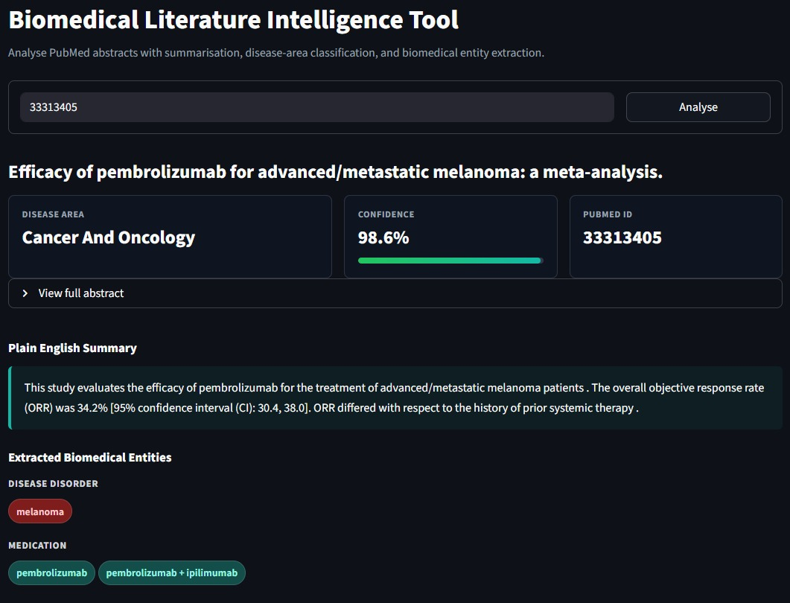
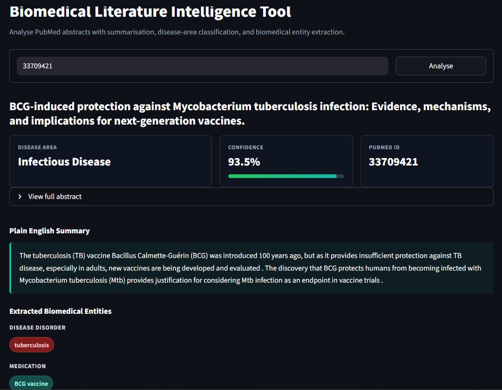
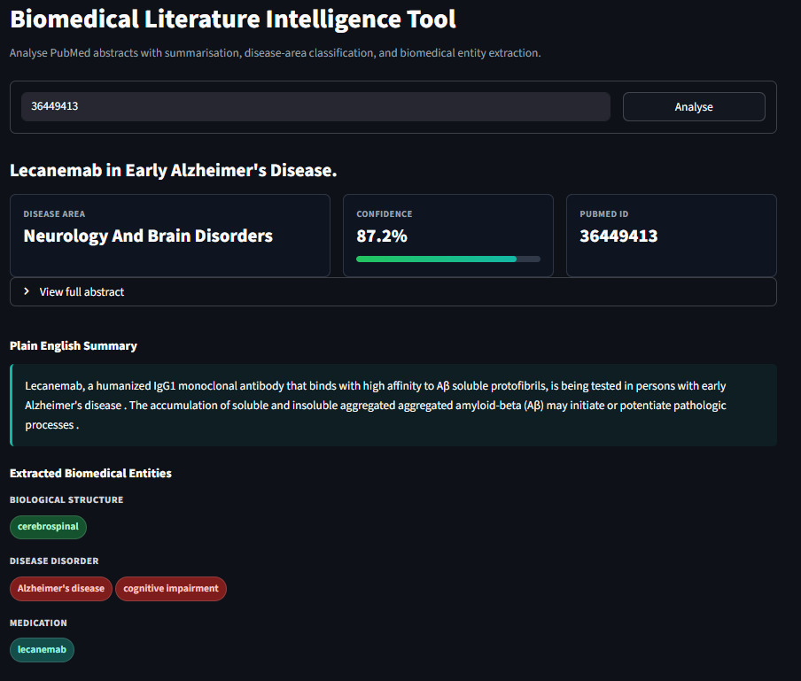

# Biomedical Literature Intelligence Tool

A biomedical NLP web app that analyses PubMed research abstracts using transformer-based models. Given a PubMed ID, it fetches the article abstract and returns a disease-area classification, a plain-English summary, and extracted biomedical entities in one Streamlit interface.

**Live app**: [blit-shlok.streamlit.app](https://blit-shlok.streamlit.app)

## Overview

Biomedical research output is growing faster than clinicians, researchers, and students can manually review. PubMed adds more than a million new records per year, making it increasingly difficult to quickly identify what a paper is about, which disease area it belongs to, and which biomedical entities matter.

This project demonstrates how transformer-based NLP models can turn unstructured biomedical abstracts into structured outputs. It is inspired by the same information extraction problems used in pharmaceutical literature monitoring, clinical decision support, and biomedical research discovery.

## What It Does

- Fetches PubMed titles and abstracts using the NCBI Entrez API
- Classifies each abstract into a disease area using zero-shot classification
- Generates a plain-English summary of the abstract
- Extracts biomedical entities such as diseases, medications, procedures, biological structures, and genes
- Displays the results in a clean Streamlit dashboard

## Example Outputs

| PubMed ID | Paper | Disease Area | Confidence |
|---|---|---|---|
| `33313405` | Pembrolizumab for advanced/metastatic melanoma | Cancer and Oncology | 98.6% |
| `33709421` | BCG vaccine and tuberculosis infection | Infectious Disease | 93.5% |
| `36449413` | Lecanemab in early Alzheimer's disease | Neurology and Brain Disorders | 87.2% |

## Screenshots

### PubMed ID: `33313405`
**Pembrolizumab and metastatic melanoma**


---

### PubMed ID: `33709421`
**BCG vaccine and tuberculosis**


---

### PubMed ID: `36449413`
**Lecanemab and Alzheimer's disease**


<!--
After adding the image files, you can replace the table above with:

### Pembrolizumab and Metastatic Melanoma


### BCG Vaccine and Tuberculosis


### Lecanemab and Alzheimer's Disease

-->

## Models Used

| Task | Model | Purpose |
|---|---|---|
| Biomedical NER | `d4data/biomedical-ner-all` | Extracts biomedical entities from titles and abstracts |
| Summarisation | `sshleifer/distilbart-cnn-12-6` | Produces concise plain-English summaries |
| Disease classification | `facebook/bart-large-mnli` | Performs zero-shot classification into disease areas |

## Why Biomedical NLP Models Matter

Generic NLP models are usually trained on broad text sources such as books, web pages, Wikipedia, and news. Biomedical abstracts contain specialized vocabulary: drug names, disease subtypes, gene symbols, endpoints, trial terminology, and clinical abbreviations.

In testing, the biomedical NER model handled domain-specific terms such as `pembrolizumab`, `lecanemab`, `tuberculosis`, and `Alzheimer's disease` much better than a generic named entity recognizer would. However, the output still needed post-processing because biomedical models can split long drug names, over-detect methodology terms, or mislabel trial language.

## Key Findings From Testing

- Classification quality improved significantly after adding missing disease labels such as `mental health and psychiatric disorders` and `public health and epidemiology`.
- Using the paper title plus abstract improved both classification and entity extraction because titles often contain the cleanest disease and drug names.
- Zero-shot classification performs well for focused papers, but multidisciplinary papers can produce lower confidence or overlapping categories.
- The BioBERT-based NER model is useful but noisy; entity cleanup rules were added to remove fragments such as partial drug names and generic terms.
- Streamlit Cloud should use Python 3.11 or 3.12 for this project. Python 3.14 caused transformer pipeline compatibility issues during deployment.
- Transformer models are cached with `st.cache_resource` so they load once per Streamlit process instead of reloading on every interaction.

## Disease Labels

The classifier currently chooses from:

- Mental health and psychiatric disorders
- Neurology and brain disorders
- Cancer and oncology
- Cardiovascular disease
- Infectious disease
- Metabolic and endocrine disorders
- Respiratory disease
- Rare genetic disorders
- Public health and epidemiology

## Known Limitations

- Entity detection can degrade on methodology-heavy abstracts where clinical terms are sparse.
- Long medication names may still require post-processing if the NER model splits them into fragments.
- Disease classification can be uncertain for papers spanning multiple disease areas.
- Summaries may preserve technical jargon from the original abstract.
- The app loads multiple transformer models, so deployment environments need enough memory.

## Tech Stack

- Python
- Streamlit
- Hugging Face Transformers
- Biopython / NCBI Entrez API
- PyTorch

## Project Structure

```text
BLIT/
|-- app.py
|-- pipeline.py
|-- pubmed_fetch.py
|-- requirements.txt
|-- runtime.txt
|-- README.md
```

## Local Setup

Use Python 3.11 for best compatibility.

```powershell
python -m venv .venv
.\.venv\Scripts\activate
python -m pip install -r requirements.txt
```

## Run Locally

```powershell
python -m streamlit run app.py
```

Try these PubMed IDs:

```text
33313405
33709421
36449413
42167272
32445440
```

